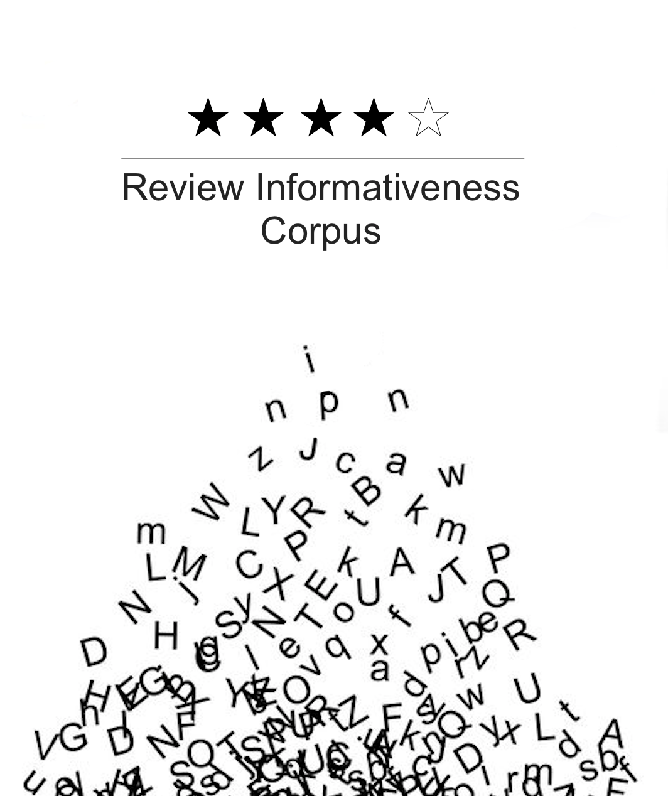

# Review-Informativeness-Corpus



## Introduction

This project is an interface of **Review Informativeness Corpus**. In this project, we built an annotated corpus from scratch with an browser interface. The corpus focused on customer reviews for various companies from [trustpilot](https://www.trustpilot.com/) website and reviews were annotated based on their informativeness which was classified into 4 levels, very informative, informative, less informative and not informative. The interface for this corpus is very accessable and user-friendly. 

## Demo


## Requirements

`python 3.7`

```python
pip install urllib3
pip install nltk
python -m pip install -U matplotlib
pip install wordcloud
```

## Usage

1. Clone this repository into your presonal computer.
2. Go into this folder and `cd interface`
3. `python backend.py`
4. open your browser, and enter `localhost:9998`

## Interface Guidelines
- **About** tab consist of information and statistics of the corpus.
- **Corpus** tab provides user with a search engine that allows to generate reviews from the corpus with desired filters. Below is an example of a search.
- **Anotation** tab showcases the rules for cuurent annotations and furthur improvements that could be made for future annotations.
- **Summary** tab allows user to look at the meta data gathered by the corpus, such as the wordcloud of the category.

## Files

### interface
- frontend.html: front end html document.
- backend.py: python document that implements functionality of the interface.
- frontend.js: javascript document that carries out the communication between frontend.html document and the Python back-end (backend.py).
- frontend.css: A css document that customizes web page.

#### [data](https://github.com/shuanggu-gs/Review-Informativeness-Corpus/tree/master/interface/data)
- corpus.json: whole corpus which has size of around 20,000 reviews
- subset_corpus_annotated.json: annotated corpus of 500 reviews

## Details of Corpus

### Source data

[Trustpilot.com](https://www.trustpilot.com) is a Danish consumer review website founded in Denmark in 2007 which hosts reviews of businesses worldwide. Nearly 1 million new reviews are posted each month. [See more](https://en.wikipedia.org/wiki/Trustpilot).

### Corpus data

We scraped ~20,000 reviews from this website. The whole corpus is [here](https://github.com/shuanggu-gs/Review-Informativeness-Corpus/blob/master/interface/data/corpus.json) in *JSON* format. Below is an example of one entry.

```python
{
        "review_id": "5e5de6113c93ae0864ac22ec",
        "company": "Boomerang Pet ID Tags",
        "category": "Animals & Pets",
        "rating": 5,
        "consumer_id": "5d8382225aa6d0d4f188acbd",
        "consumer_name": "Lesa",
        "consumer_review": "Best tags on the market. If you want to increase the chances that your pet finds their way home if they get lost, buy these tags."
}
```

Meanwhile, we have a subset corpus in *JSON* format containing 500 reviews for annotation. Click [here](https://github.com/shuanggu-gs/Review-Informativeness-Corpus/blob/master/interface/data/subset_corpus_annotated.json). Those 500 entries were annoated on [Amazon Mechanical Turk](https://www.mturk.com/).

### Statistics Properties

The total number of reviews in our corpus is *19,968* including *1,134,966* words. Below shows the number of reviews coming from each categories. 


|     category            | counts |
|-------------------------|--------|
|Animals & Pets |1197|
|Beauty & Well-being |85|
|Business Services |1381|
|Construction & Manufacturing |881|
|Education & Training |995|
|Electronics & Technology |1242|
|Events & Entertainment |1045|
|Food, Beverages & Tobacco |1229|
|Health & Medical |962|
|Hobbies & Crafts |1483|
|Home & Garden |524|
|Home Services |148|
|Legal Services & Government |984|
|Media & Publishing |1242|
|Money & Insurance |33|
|Public & Local Services |818|
|Restaurants & Bars |1344|
|Shopping & Fashion |1048|
|Sports |726|
|Travel & Vacation |1235|
|Utilities |222|
|Vehicles & Transportation |1144|